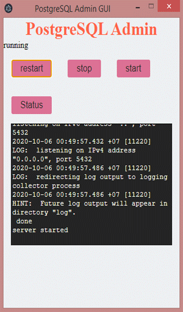

<h2 style="text-align:center;">PostgreSQL GUI</h2>

<b>I'm a Windows User who love play with my cursor!</b>

Does CLI make life easier?.

<b>NO</b>

---

> _still under personal experimental version_
>
> > Support React >=@16.13.x || < @17.x

---

## Apps

## NOTES

#### to do

- [x] plan,analysis,.. [continues..]
- [x] add command start|stop|restart|status
- [ ] kill server
- [x] create logs
- [ ] delay process start|stop|status|restart
- [ ] Design UI & styling
- [ ] update Info Message
- [ ] manage state
- [ ] testing
- [ ] optimize
- [ ] pages gh
- [x] documentation [5%]
- [ ] adding support files or configuration
- [ ] bugs, issue
